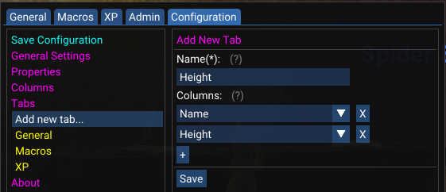

# BoxHUD

[View Repo](https://github.com/aquietone/boxhud){target=_blank}  
[View on RedGuides](https://www.redguides.com/community/resources/boxhud.2088/){target=_blank}  
[Download](https://github.com/aquietone/boxhud/-/archive/master/boxhud-master.zip)  

A HUD which uses DanNet to display box information.

## Overview

This Lua script provides an alternative to a similar `MQ2HUD/MQ2NetBots` based HUDs. Instead, it uses observed properties from `MQ2DanNet` to watch various bits of information about all your peers. It can also still use `MQ2NetBots` properties as well, though that is less tested.

## Installation

### Manual Install

1. Clone the repo or download the zip file linked above.  
2. Move `boxhud.lua`, the `boxhud` folder and `lfs.dll` into the MQ `lua` folder.  

### RedGuides Launcher

1. Navigate to the BoxHUD resource page and click the `Watch` button on the `Overview` tab.  
2. Open the RedGuides Launcher and install BoxHUD from the `Lua` tab.  

## Commands

- `/lua run boxhud` -- Start the script  
- `/lua stop boxhud` -- End the script  
- `/boxhud` -- Toggle the UI window  
- `/bhadmin anon` -- Toggle anon mode (swap names with class in name column)  

## Adding a new property to the HUD

To add new data to BoxHUD, there are a few steps:

1. Decide what data you want to display. Refer to the [MacroQuest TLO Docs](https://docs.macroquest.org/reference/top-level-objects/){target=_blank} to find the TLO member you are interested in displaying. For example, maybe you want to show `Me.Height`.  
2. Once you know the TLO member, the next step is to define a property for it. On the `Config` tab, expand `Properties` and select `Add New Property`. Enter the TLO member as the property name, `Me.Height` in the case of this example.  
  
3. After defining a property, a new column must be defined to describe how that property should be displayed. On the `Config` tab, expand `Columns` and select `Add New Column`. Enter a name for the column, such as `Height`. Select the property `Me.Height` to be displayed for `all` classes. Set a `Threshold` value of `2`. This will cause the column to display toons with a height greater than `2` in `red`, and toons shorter than `2` in `green`.  
  
4. The next step is to add the new column to a tab. It can be a new tab or one of the existing tabs. For the example, we will add a new tab called `Height`. On the `Config` tab, expand `Tabs` and select `Add New Tab`. Enter the name `Height` for the tab and add the `Height` column, then click save.  
  
5. Finally, add the new `Height` tab to the default window. On the `Config` tab, expand `Windows` and select `Default`. Click the `Edit` button and add the new `Height` tab, then click save.  

At this point, the default BoxHUD window should be showing the new tab which displays a column with the height of each of your characters.  
  