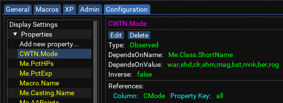

# Property Configuration

Properties are the base configuration item in BoxHUD and define the TLOs which will be referenced by columns in the table.  
There are 3 types of properties:  

* `Observed`  
* `NetBots`  
* `Spawn`  

Properties can be configured directly in the HUD configuration tab.

## Observed properties

Observed properties define a property for which a DanNet observer should be created for each character, to monitor the value of that property from each character.  
For ideas on other observed properties to add, check out the MQ TLO docs here: [MacroQuest Docs](https://docs.macroquest.org/reference/top-level-objects/){target=_blank}.

> NOTE: All TLO members are case sensitive. For example, `me.pcthps` or `Me.Pcthps` or `Me.PctHps` will fail. Only `Me.PctHPs` will work. Adding observers on TLO members that don't exist can have annoying consequences. If you're unsure, `/echo` it first.

To add a property that should be observed on all characters, just set the property name. For example, to add `Me.Level`:


In the `boxhud-settings.lua` file, this will be added as:

```lua
Properties = {
    ["Me.PctHPs"] = {
        ["Name"] = "Me.PctHPs";
        ["Type"] = "Observed";
    };
}
```


Observing properties which are not defined on a character can impact running macros. To avoid this, there are some optional settings which can be added to Observed property definitions to define conditions for when to create the observer for a given character:



The above image shows how to add a property which should only be observed on certain characters, like only those classes which are running CWTN plugins.
Set the `DependsOnName` to `Me.Class.ShortName` and `DependsOnValue` to the list of classes which have CWTN plugins loaded.

In the `boxhud-settings.lua` file, this will be added as:

```lua
["Properties"] = {
    ["CWTN.Mode"] = {
        ["Name"] = "CWTN.Mode";
        ["Type"] = "Observed";
        ["DependsOnName"] = "Me.Class.ShortName";
        ["DependsOnValue"] = "war,shd,clr,shm,mag,bst,mnk,ber,rog";
        ["Inverse"] = false;
    };
```

## NetBots properties

```lua
Properties = {
    ['PctMana'] = {
        ["Name"] = "PctMana";
        ["Type"] = "NetBots";
    };
}
```

NetBots properties define a property to get from `MQ2NetBots` for each character.

## Spawn properties

```lua
Properties = {
    ["Distance3D"] = {
        ["Name"] = "Distance3D";
        ["Type"] = "Spawn";
    };
}
```

Spawn properties define a property to read from the Spawn data for each toon. These will only work for toons that are in the same zone as only they would have Spawn data available.

## Properties summary

All 3 types of properties can be mixed together, provided they have unique names. Combining the 4 example properties above, we would have:

```lua
Properties = {
    ['Me.PctHPs'] = { Name='Me.PctHPs', Type='Observed' },
    ['PctMana'] = { Name='PctMana', Type='NetBots' },
    ['Distance3D'] = { Name='Distance3D', Type='Spawn' },
    ['CWTN.Mode'] = {
        Name='CWTN.Mode',
        Type='Observed',
        DependsOnName='Me.Class.ShortName',
        DependsOnValue='war,shd,clr,shm,mag,bst,mnk,ber,rog',
        Inverse=false,
    }
}
```