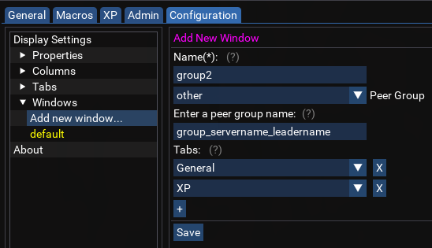
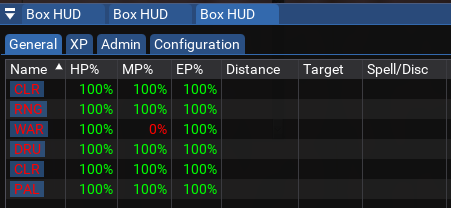

# Window Configuration

Each window defines a DanNet peer group which it will display characters from, and the list of tabs that will be displayed in the window.  
Windows can be configured directly in the HUD configuration tab:

There are 4 options for the DanNet peer group which can be configured for a window:  

* *all* -- The window will show all characters connected to DanNet, from the all peer group.  
* *zone* -- The window will show all characters in the same zone as the character running Boxhud, from the automatically created DanNet peer group for the current zone.  
* *group* -- The window will show all characters in the same group as the character running Boxhud, from the automatically created DanNet peer group for the group. Note that the automatically created group in DanNet relies on the group leaders name, and Boxhud is currently written to expect the character running Boxhud to be the group leader. This means that if the window is set to use "group" and your characters name is "aquietone", then the window will display characters from the group "group_myserver_aquietone".  
* *other* -- If you want to enter your own DanNet peer group which is not covered by the above, then select other and enter your own group name.

By creating more windows, you can split out different groups if you are running multiple different teams and want to keep them separated. The windows can be docked together, kept separate, etc.:

Ex. Adding a window for another group:  

3 Boxhud windows docked together as a tabbed window:  

3 windows docked together vertically:  

