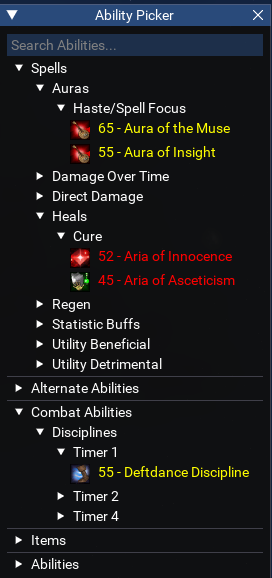
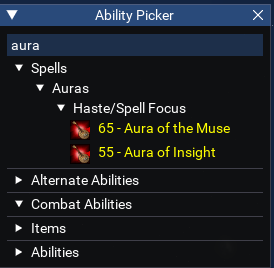

# Ability Picker

[View Repo](https://github.com/aquietone/ability-picker){target=_blank}  
[Download](https://github.com/aquietone/ability-picker/-/archive/main/ability-picker-main.zip)  

 

## Overview

This lua script is meant to be used as a module in a broader script, providing a window for searching through spells, AAs, disciplines, items and abilities such as for populating a KissAssist INI.

## Installation

Download the zip and extract it, placing `abilitypicker.lua` into your own scripts folder to be used as a module.

## Usage

```lua
-- Include the ability picker module in your script
local AbilityPicker = require('AbilityPicker')

local isOpen, shouldDraw = true, true
-- Create a new instance of the ability picker
local picker = AbilityPicker.new()

local function updateImGui()
    if not isOpen then return end

    isOpen, shouldDraw = ImGui.Begin('AbilityPickerSample', isOpen)
    if shouldDraw then
        -- Add a button or some other means of opening the ability picker
        if ImGui.Button('Open AbilityPicker') then
            -- Set the picker to open when your button is pressed
            picker:SetOpen()
        end
        -- When an ability has been selected, picker.Selected will contain info of the selected ability
        if picker.Selected then
            local selected = picker.Selected or {}
            -- Depending on the type of ability selected, some different info is available through picker.Selected
            if selected.Type == 'Spell' or selected.Type == 'Disc' then
                ImGui.Text('Selected %s:\nID=%s\nName=%s\nRankName=%s\nLevel=%s', selected.Type, selected.ID, selected.Name, selected.RankName, selected.Level)
            elseif selected.Type == 'Item' then
                ImGui.Text('Selected %s:\nID=%s\nName=%s\nSpellName=%s', selected.Type, selected.ID, selected.Name, selected.SpellName)
            elseif selected.Type == 'AA' or selected.Type == 'Ability' then
                ImGui.Text('Selected %s:\nID=%s\n%s', selected.Type, selected.ID, selected.Name)
            end
        end
        -- Clear the picker.Selected state, done here with a separate button just for the example
        if picker.Selected and ImGui.Button('Clear Selection') then
            picker:ClearSelection()
        end
    end
    ImGui.End()
    -- Draw the ability picker window
    picker:DrawAbilityPicker()
end
```
