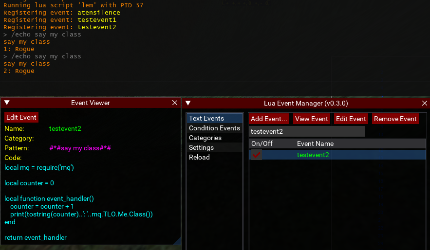
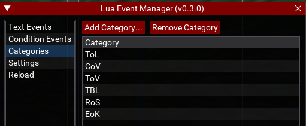

# Event Manager

[View Repo](https://gitlab.com/aquietone/event-manager){target=_blank}  
[View on RedGuides](https://www.redguides.com/community/resources/lua-event-manager.2539/){target=_blank}  
[Download](https://gitlab.com/aquietone/event-manager/-/archive/dev/event-manager-dev.zip)  

A weakauras-like take on text based events (like `MQ2Events`) and condition based events (like `MQ2React`).

## Overview

Lua Event Manager is intended to provide an alternative to `mq2events`, `mq2react` and one-off lua scripts being written for events.  

Rather than events with giant, difficult to read macro if statements, easy to read lua functions can be written to handle events instead.  

Rather than reacts with a YAML file that frequently gets corrupted or breaks from indentation mistakes, more complex conditions and actions can be implemented.  

Event definitions are global and stored in a shared `lem/settings.lua` file. Editing events from multiple characters can overwrite changes if you aren't reloading before making edits on a character.  
Event enabled/disabled state is stored per character in a characters own `lem/characters/{name}.lua` file. Hopefully this allows to more safely enable or disable events across characters.  

## Installation

### Manual Install

1. Clone the repo or download the zip file linked above.  
2. Move `lem.lua` and the `lem` folder into the MQ `lua` folder.  

### RedGuides Launcher

1. Navigate to the Lua Event Manager resource page and click the `Watch` button on the `Overview` tab.  
2. Open the RedGuides Launcher and install Lua Event Manager from the `Lua` tab. 

## Commands:

- `/lua run lem` -- Start the script  
- `/lem [help]` -- display help output  
- `/lem event <eventname>` - toggle text event enabled/disabled  
- `/lem cond <eventname>` - toggle condition event enabled/disabled  
- `/lem show` - show the UI  
- `/lem hide` - hide the UI  
- `/lem reload` - reload the script (currently by just restarting the script)  

## Defining Event Categories

Categories provide a way to group up events, to help keep the text and condition events sections organized. Several example categories are pre-defined, and more can be added or removed from the Categories section.  

## Managing Events

The Text Events and Condition Events sections provide controls for adding, editing and deleting events.  
The event list can be filtered by name to help find the event you are looking for.  

Full details of an event can be viewed by double clicking the row in the events table or clicking the View Event button.  

## Editing Event Code

All event implementations are saved to individual lua files in `/lua/lem/events` or `/lua/lem/conditions`.  
Editing the code in an external text editor like [Visual Studio Code](https://code.visualstudio.com/download){target=_blank} is recommended over using the text box in LEM, as it can provide several development features that make life writing code much easier.  

## Import/Export

To enable sharing of events between users, events can be imported and exported to/from LEM.

### Exporting Events

Exporting events is done by right clicking an event in the event list and clicking `Export` in the context menu that appears, or by clicking the `Export` button in the event viewer.  

A base64 encoded string will be copied to the clipboard when you click `Export`. This will look like a long string of letters and numbers.  

### Importing Events

On the left hand side of LEM, select `Import`. Use the `Paste from clipboard` button to paste the base64 encoded string of the event you wish to import, and then click `Import`.  

This will open the imported event in the `Add Event` window, which you can then save into your event library.  